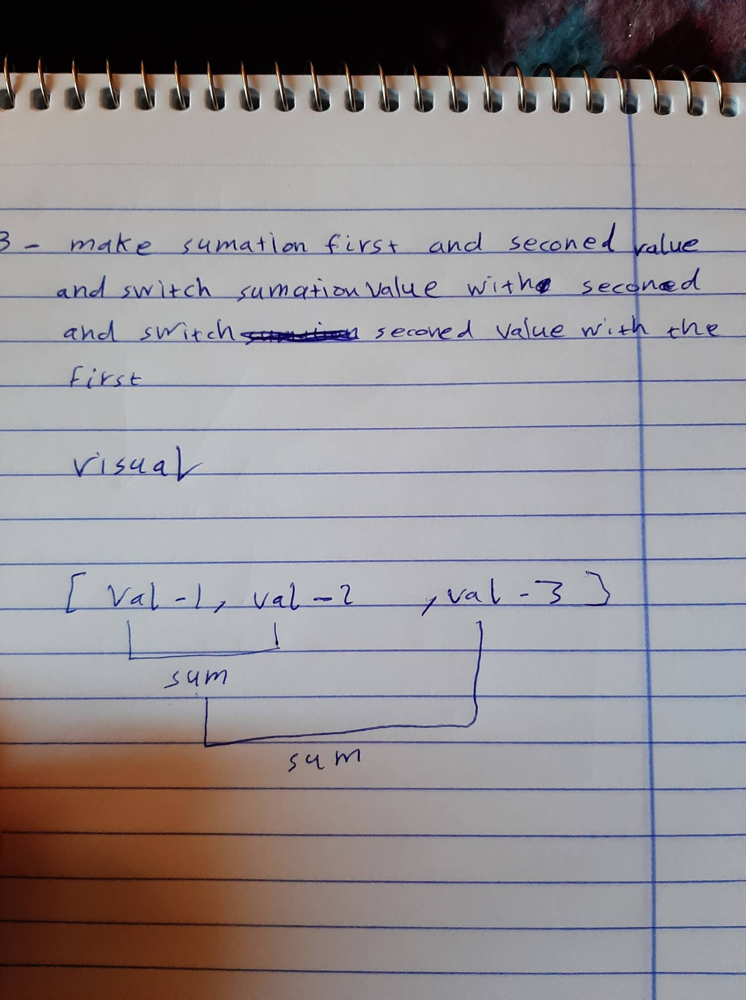
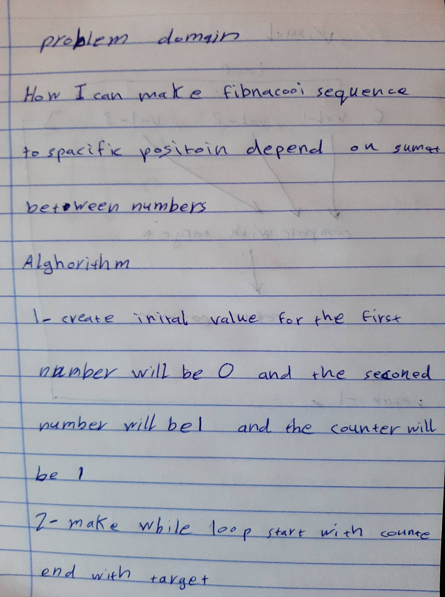

# Challenge Summary
in this challange he want you to create fibnaccoi sequence and reduce method 

## Challenge Description
the challange  most of it about how i can make sequence of sumation to creat golden ratio also how i can reduce the array to one value using sumation   

## Approach & Efficiency
in the worst case the big O notation will be O(n) cause the While loop will go to the length of all number under the target also O(1) to the sapce cause here we dont deal with the big data most the space in memory will be empty  

## Solution

