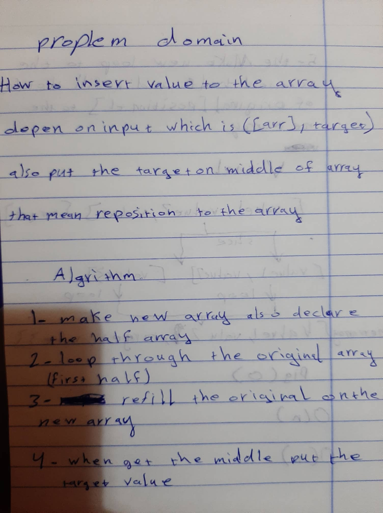

# Challenge Summary
this challange talk about how you can insert value to the array spaicific in the middle without using any array method build in ES6

## Challenge Description
the challange have good point which is here you need to increase the length of array and repoisition every value after the insert value also toy must be careful about the length of original array is it odd or even 

## Approach & Efficiency
in the worst case the big O notation will be O(n) cause the loop will go to the length of the  first half array also another loop go through the seconed half of the array some time will be length +1 but that called static in complexity will not count    

## Solution

